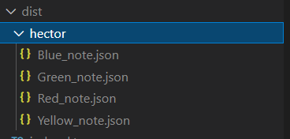
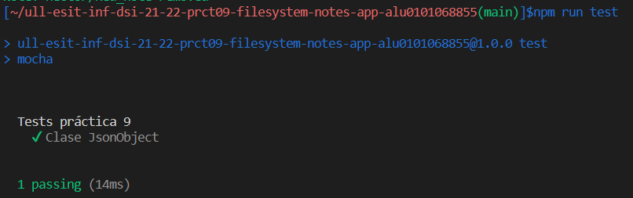

# Informe Práctica 9
Para el desarrollo de esta práctica, en primer lugar se ha comenzado con archivos como el **.txt**, más adelante, una vez comprendido el desarrollo y funcionalidades de [yargs](https://yargs.js.org/docs/), se han modificado para poder trabajar con archivos **.json**.

## Explicación del funcionamiento de la app
Nuestro programa principal estará ubicado en la ruta *'./dist/index.js'* y para su ejecución:

```typescript
/*
* En el caso de add o mod
*/
node ./dist/index.js add/mod --user="Username" --title="Note title" --body="body of the note" --color="color selected" 
```
En este caso se necesitan todos los parámetros que se han indicado en el **yargs.commands** y añaden o modifican una nota.

```typescript
/*
* En el caso de remove o read
*/
node ./dist/index.js remove/read --user="Username" --title="Note title" 
```
En el caso del **remove** o del **read**, nos bastará con conocer al *usuario* y el nombre de la *nota*. 

```typescript
/*
* En el caso de list
*/
node ./dist/index.js list --user="Username" 
```
Por último para listar, sólo será necesario el nombre del *usuario*.


*Imagen del funcionamiento de la app*



*Comprobar la creación de directorio y archivos **.json**.*


*Comprobación de que el remove ha tenido éxito*

## Desarrollo
Para el desarrollo de la práctica se han importado los siguientes paquetes:

- API síncrona (fs)
- Chalk para el color de los textos por consola.
- Yargs para parsear diferentes argumentos por consola.
- Path para la creación de directorios.

Nuestra clase ```JsonObject()``` contendrá un usuario, un titulo, un cuerpo y un color como se puede observar:

```typescript
/**
 * Class JsonObject
 */
export class JsonObject{
  constructor(private user: string, private title: string, private body: string, private color: string ){}
  getUser(){
    return this.user;
  }
  getTitle(){
    return this.title;
  }
  getBody(){
    return this.body;
  }
  getColor(){
    return this.color;
  }
}
```


```typescript
/**
 * Commands add
 */
yargs.command({
  command: 'add',
  describe: 'Add a new note',
  builder: {
    title: {
      describe: 'Note title',
      demandOption: true,
      type: 'string',
    },
    user: {
      describe: 'Name user',
      demandOption: true,
      type: 'string',
    },
    body: {
      describe: 'Body of the note',
      demandOption: true,
      type: 'string',
    },
    color: {
      describe: 'Color of the letters',
      demandOption: true,
      type: 'string',
    }
  },
  handler(argv) {
    if (fs.existsSync(`./dist/${argv.user}`)){
      console.log(chalk.green(`Dir ./dist/${argv.user} exists`));
    }
    else{
      fs.mkdir(path.join(__dirname, String(argv.user)), (err) => {
        if (err) {
          return console.error(chalk.red(err));
        }
        else {
          console.log(chalk.green(`Created dir ${argv.user} at ./dist/`));
        }
      });
    }
    //Sin timeout no se puede crear
    if (fs.existsSync(`./dist/${argv.user}/${argv.title}.json`)){
      console.error(chalk.red('This file already exists'));
    }
    else{
    let obj = new JsonObject(String(argv.user), String(argv.title), String(argv.body), String(argv.color));
    let json = JSON.stringify(obj, null, 2);

      setTimeout(() => {
        fs.writeFile(`./dist/${argv.user}/${argv.title}.json`, json, 'utf8', (err) => {
          if (err) {
            return console.error(chalk.red(err));
          }
          else{
            console.log(chalk.green(`Created ${argv.title}`));
          }
        });
      }, 1000);
    }
},
});
```
En este ejemplo tenemos el comando ```add```, en el handler tenemos los argumentos **argv** que necesitaremos. Primeramente se comprueba que existe el directorio, y en caso contrario, se crea uno con el nombre del usuario. En el caso de que exista y no exista el title con el nombre del fichero, se añade un fichero *.json* a la ruta del usuario. Para ello se usa el método **existsSync**. Luego añadimos un objeto de la clase que hemos creado y se transforma a tipo string su contenido para luego hacer un writeFile y crear el fichero con el cuerpo del objeto ya formateado.

Cabe destacar que sin un **timeout**, este código no sería posible de realizar, porque se lanzaría de manera inmediata todo a la vez. Por ello, le hemos asignado un retardo de 1s (1000ms) para que primero cree un directorio y luego se creen los archivos. Porque de caso contrario habría un conflicto entre la creación de directorios y ficheros, porque se intentarían lanzar de manera simultánea.

En el caso del comando ```mod```, es lo contrario en algunos aspectos al add, ya que primero se comprueba que el fichero exista y en caso afirmativo se realiza el cambio.


```typescript
/**
 * Commands list
 */
yargs.command({
  command: 'list',
  describe: 'Lists all users notes',
  builder: {
    user: {
      describe: 'Username',
      demandOption: true,
      type: 'string',
    } 
  },
  handler(argv) {
    if (fs.existsSync(`./dist/${argv.user}`)){
      console.log(chalk.green(`Your notes`));
      fs.readdir(`./dist/${argv.user}`, (err, files) => {
        if (err) {
          return console.error(chalk.red(err));
        }
        else {
          files.forEach(element => {
          let obj = require(`./${argv.user}/${element}`);
          if (obj.color === 'yellow'){
            console.log(chalk.yellow(obj.title));
          }
          if (obj.color === 'red'){
            console.log(chalk.red(obj.title));
          }
          if (obj.color === 'green'){
            console.log(chalk.green(obj.title));
          }
          if (obj.color === 'blue'){
            console.log(chalk.blue(obj.title));
          }
          });
        }
      });
    }
    else{
      console.error(chalk.red(`Invalid user: ${argv.user}`));
    }
  }
});
```

El ejemplo anterior es el del comando ```list``` que comprueba si existe el usuario primeramente y en caso afirmativo comienza a escribir por consola los archivos en el **color** designado que contiene el directorio del usuario.

Para el caso del ```remove```, destacar que se comprueba si existe el archivo especificado del usuario especificado y en caso de que exista se elimina con:

```typescript
fs.promises.rm(`./dist/${argv.user}/${argv.title}.json`);
```
Por último, tenemos al comando ```read``` que es bastante parecido al ```list```, pero en este caso en vez de mostrar el *title* del archivo del usuario, se lee el **body** en el **color** que tiene el objeto.

## Tests
Para los test, se han comprobado en la API que funciona correctamente los cambios efectuados con los comandos proporcionados y además se ha realizado un **spec** del archivo *index*.



## Conclusiones
Al principio se ha desarrollado todo el código en formato txt para conseguir un entendimiento de cómo desarrollar la práctica, en los commits se pueden visualizar en caso de requerirlo.
Finalmente se ha estudiado la creación de archivos .json y el método para pasar un objeto a un string y así poder trabajar sobre los archivos .json de manera más sencilla, pudiendo acceder a las propieadades específicas como el caso del color para administrar y mostrar por consola.